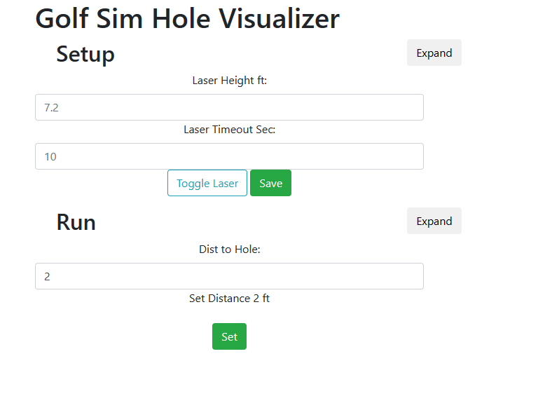

# Golf Sim Hole Visualizer

## Background

I have a OptiShot 2 golf simulator and found that putting was a pain. There was no visual representation of the hole. This is designed to help solve this issue by showing a red dot where the hole is relative to the putter to assist in more accurate putting.

## Info

This is a basic set of code using some trig to determine the angle to set the laser. This assumes that the laser is hanging from the Celing directly above the ball.

You can interact with the device either over serial or by going to the ip address of the esp32.

### Device Web Page

### Hardware

1) An ESP32 (Haltec esp32 V1) but any esp32 should work
2) Two SG90 Servos
3) This 3D Printed PanTilt module <https://www.thingiverse.com/thing:4710301>
4) An Arduino Laser module. (or any that can be triggered by 3.3v)
5) Hot glue...

#### Wireing Diagram

### Code

The code is written in C++ using Arduino Libraries and Platform.io as the environment. Also using Visual Studio code as the IDE.

#### Deploy

1) Modify the ssid and password to match your wifi network. 
2) Run platform io build
3) plug in the esp32
4) Build Filesystem Image -- To Include the html page in spiff
5) Upload Filesystem Image
6) Run platform io deploy

##### Note

You may need to change the board in the platformio.ini file to match your specfic board. Boards can be found at platform io.

### Assembly

--TODO

### Setup

1) Assemble the Pieces to create a PanTilt laser thingy
2) Mount the thingy directly above the Golf Sim pad
    - you may use the web interface to turn on the laser to see that it is directly above the ball

3) In the web interface 'Expand' the setup section and populate with your preferences. The main item is the celing height. This is actually the height from the ball to the laser.
4) Expand the run section and enter a value for the distance of the ball in ft. (This would normally be present on the golf sim)
    - Pressing run should activate the servo to the correct angle and enable the laser for 5 sec (or whatever was configured)
